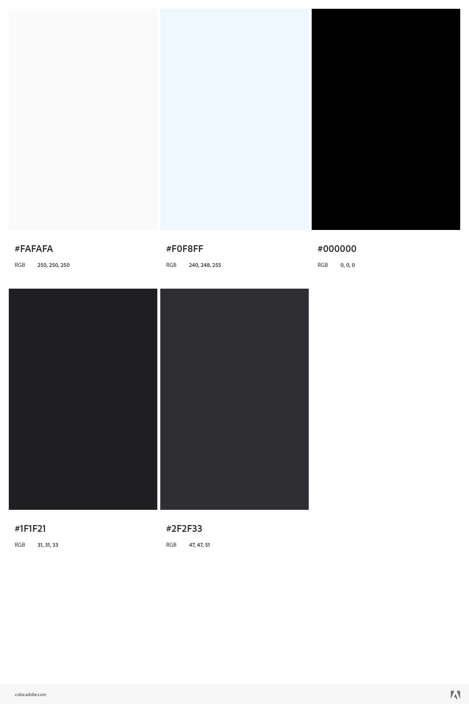

## Recognition Rather Than Recall ##
I would like to make sure I make my site visible, and simple to read and understand. I also want to avoid making the user remember a bunch of information, they just want the most straightforward path to your website's features. Making sure to keep the text simple and to the point is very important, instead of listing your full company name everywhere maybe use an acronym. Once you've declared it once, you probably don't need to declare it again.
## Aesthetic and Minimalist Design ##
The goal of my website is to also make it visually appealing, a nice simple color scheme puts less strain on the eyes and can relax the user and in turn, keep them around longer. No one would like it if the about page went rambling on about something completely irrelevant, this would take away from the website. It's best for my website that information stays relevant and that links lead to their proper places.
## Notes ##
The above heuristic goals are things that will need to be looked at with every update.
## Design ##

## Color Palette ##
* The reason I chose the color palette below is that I want to keep the website simple and minimalist and I feel that the colors I have chosen fit that style.
* I would like to keep the default Times New Roman font to keep the simple and minimalist aesthetic. As far as caps and boldness go, I will mostly keep it simple, the exception would be page titles which should be big. My website will also use professional language while staying easy to read.  
## Color Palette Image ##
