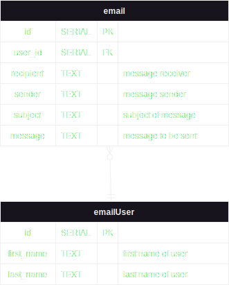
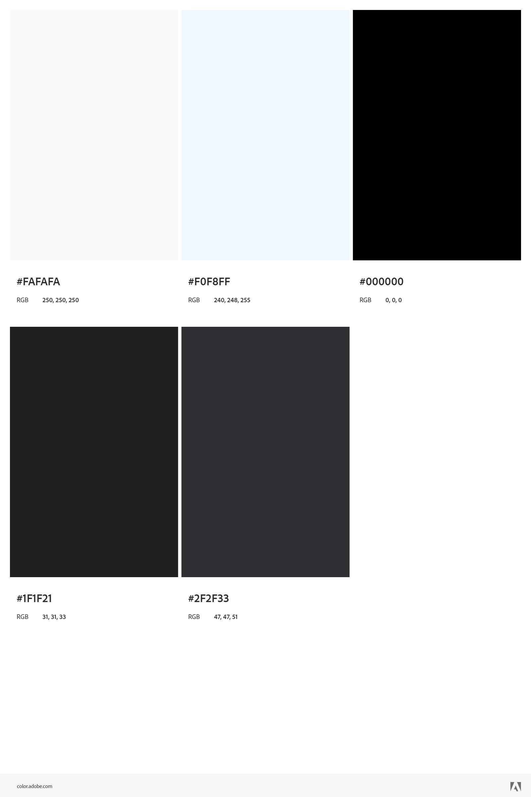

# Minimalist Mail Manager #
Minimalist Mail Manager is a site that provides standard email features in a simple and easy-to-use way. The main appeal of the site would be how the emails open. Instead of the email expanding to the whole page, my design would slide down and open up showing the full message as well as actions like "Reply" etc. There will also be navigational links for the user's inbox and sent.

## Web service ##
[Sendgrid](https://docs.sendgrid.com/api-reference/how-to-use-the-sendgrid-v3-api/authentication "Sendgrid API") (API)  
  * GET - https://api.sendgrid.com/v3/endpoint HTTP/1.1
  * POST - https://api.sendgrid.com/v3/templates/ HTTP/1.1
  * DELETE - https://api.sendgrid.com/v3/templates/ HTTP/1.1

## Database use ##
The database will be used to record emails that are sent from or to the user.  
This will require two tables: **inbox** containing emails to the user, and **sent** containing emails from the user. Both of these would be tied to one userId.

## Initial designs ##

* * *

* * *
## ER Diagram ##

* * *
## Color Palette ##
* The reason I chose the color palette below is that I want to keep the website simple and minimalist and I feel that the colors I have chosen fit that style.
* I would like to keep the default Times New Roman font to keep the simple and minimalist aesthetic. As far as caps and boldness go, I will mostly keep it simple, the exception would be page titles which should be big. My website will also use professional language while staying easy to read.  
